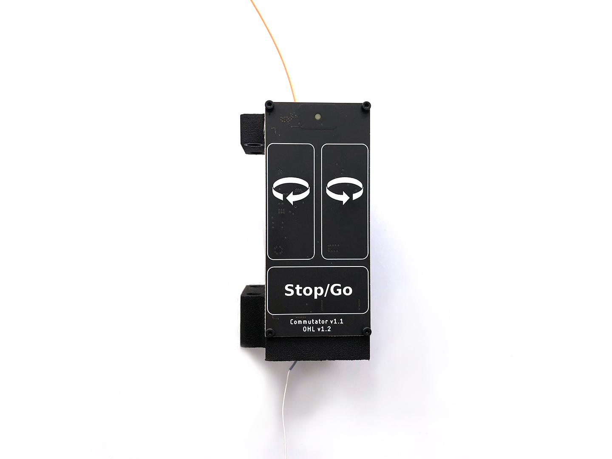

.. _commutators:

Coaxial Commutators
===================================
Active, near-zero torque commutators to prevent tether twisting during
freely moving recordings with headstages and/or miniscopes.

.. toctree::
    :maxdepth: 1
    :hidden:

    setup
    usage

:Design Repository: https://github.com/open-ephys/commutators
:Compatibility: :ref:`pcie_host`, :ref:`headstage_64`,
                :ref:`headstage_neuropix1`, :ref:`miniscopes`

.. _commutators_overview:

Overview
#########################

  ONIX Single Channel Commutator

ONIX uses an active commutator to prevents tether twisting during freely moving
recordings.  A inertial measurement unit (IMU) on the headstage or miniscope
sends orientation data to the host computer. Because the real-time orientation
of the animal is known, software (e.g. Bonsai) can be used to send commands to
the commutator via its USB interface, and the motor in the commutator willturn
when the animal does. A high-quality radio-frequency rotary joint inside the
commutator maintains electrical connectivity for both power and high-frequency
data signals between the tether leading to the headstage and the coaxial cable
leading to the PCIe host board while turning.

Features
-------------------------
- High bandwidth link up to 18 GHz
- Optical table & 80/20 rail mountable
- Remote control using JSON-encoded commands
- Manual control using capacitive sense buttons
- Indication LED (can be turned off)
- Advanced stepper driver (TMC2130)

  - Voltage-controlled for silent operation
  - Precise motion using step interpolation (256 uSteps/step)

- USB powered and controlled

  - Internal super-capacitor circuitry prevents loading the USB bus during
    motion
