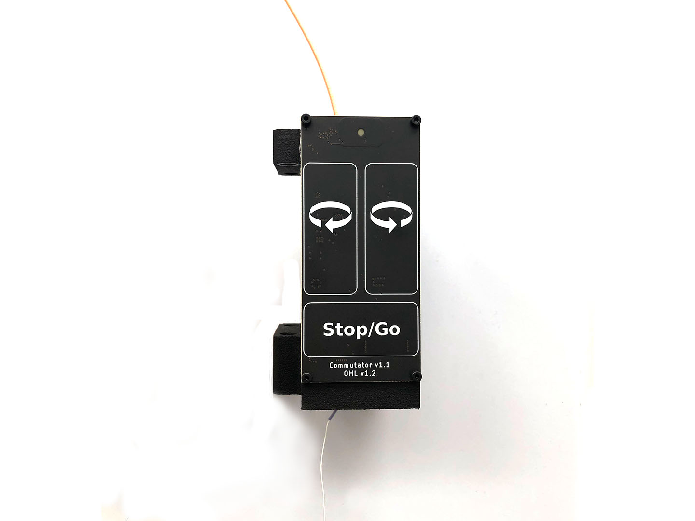

.. _commutator_setup:

Setup
#########################

.. image:: ../../_static/images/commutator/commutator_usb_sma.jpg
  :width: 49%

- Mount the active commutator above the setup (you can use the same frame as the base stations, with the commutator in the middle).

- Connect the commutator to the computer using a USB to micro-USB cable

.. note::
  Add how to test commutator in Bonsai
