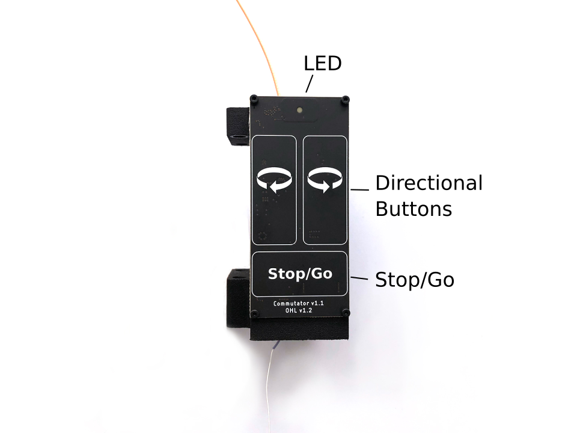

.. _commutator_usage:

Usage
==================================
The commutator is powered over USB. It can be controlled using the buttons on
the front panel or by receiving commands from the computer over USB.

LED
----------------------------------
The LED tells you about the commutator state:

#. Flashing red (*Charging*): commutator is charging internal super-capacitors.
   All controls and motor operation are locked. Wait until this process
   completes to use the device. It can take up to 30 seconds.
#. Solid red (*Disabled*): commutator is disabled. Motor is turned off and will not
   turn or respond to button presses or external commands.
#. Green (*Enabled*): commutator is enabled and permits both remote and manual
   (button) turn control. Buttons take precedence over remote commands.

The LED can be turned off by pressing and holding it > 500 msec. It can be
turned back on by pressing it.

Buttons
----------------------------------
The front panel has four buttons.

:Stop/Go: Press to toggle commutator enable/disable.

          - *Disabled* (LED is red): All motor output will halt instantly, and motor
            driver is powered down. Pressing directional buttons in the stopped state
            will not work. All target turns provided via remote calls will be
            cleared, such that re-enabling the motor will not result in the commutator
            re-engaging an old target position. In this state, pressing and holding
            the Stop/Go button for > 0.5 second, or sending the approriate remote
            command will enable the device.
          - *Enabled* (LED  green): When in the *enabled* state, the LED will be
            green and the motor can be turned via button presses or RPCs . In this
            state, pressing the Stop/Go button will instantly disable the device.

:Directional: Press to manually control the motor rotation in the direction indicated on
              each button when the commutator is *Enabled*. These inputs take
              precedence over and override ongoing remote motor control.  When
              pressed, all target turns provided via remote control will be
              cleared, such that releasing them will not result in the
              commutator re-engaging an old target position. Remote commands
              sent when a button is being pressed are ignored.

:LED: Pressing the LED turns it off (e.g for cases where it presents an
      unwanted visual stimulus). Pressing it again turns it back on.

Remote control interface
-----------------------------------
When manual buttons are not being pressed, the commutator accepts JSON-encoded
commands over its serial interface. Here are examples of all commands that can
be sent:

.. code-block:: json

   {enable : true}     // Enable commutator (default = false)
   {led : false}       // Turn off RGB LED (default = true)
   {speed : 250}       // Set turn speed to 250 RPM (default = 50 RPM, valid ∈ (0, 500] RPM)
   {turn : 1.1}        // 1.1 turns CW
   {turn : -1.1}       // 1.1 turns CCW

   // Example multi-command. Any combo can be used.
   // In this case:
   // 1. Turn LED off
   // 1. Set speed to 25 RPM
   // 2. Excecute 1.1 turns CC
   // Ordering of commands does not matter
   {led: false, speed: 25, turn : -1.1}

The communator state can be read using the :code:`{print:}` command  which will
return a JSON object containing control and motor parameters. 

.. note:: Have a look at the :ref:`bonsai_commutator` for a basic example of
   how the commutator can be controlled from the computer. Additionally, the
   :ref:`bonsai_headstage64` shows how the commutator can be controlled using
   the headstage IMU for torque-free commutation during free-moving
   experiments.

Saving settings
-------------------------------------
All control and speed parameters, whether changed via the remote or manual
interface, are saved in non-volatile memory each time they are changed. The
device will start in the same state it was last used.

Firmware
-------------------------------------
The controller firmware runs on a `Teensy
3.2 <https://www.pjrc.com/store/teensy32.html>`__. To compile this firmware and
program the microcontroller, you need the following dependencies:

- `Arduino IDE <https://www.arduino.cc/en/software/>`__
- `Teensyduino add-on <https://www.pjrc.com/teensy/td_download.html>`__
- `AccelStepper <https://www.airspayce.com/mikem/arduino/AccelStepper/>`__
- `Arduino JSON <https://arduinojson.org/>`__

The firmware can be uploaded to the device using the `Arduino
IDE <https://www.arduino.cc/en/software/>`__. 

.. note:: You will need to add the `Teensyduino add-on
   <https://www.pjrc.com/teensy/teensyduino.html>`__ to the Arduino IDE to program
   the Teensy. When installing Teensyduino, you should opt to install all of the
   bundled libraries as well. This takes care of installing :code:`AccelStepper`
   library rather than having to install it manually. ArduinoJSON can be
   installed through the Arduino IDE's package manager.

