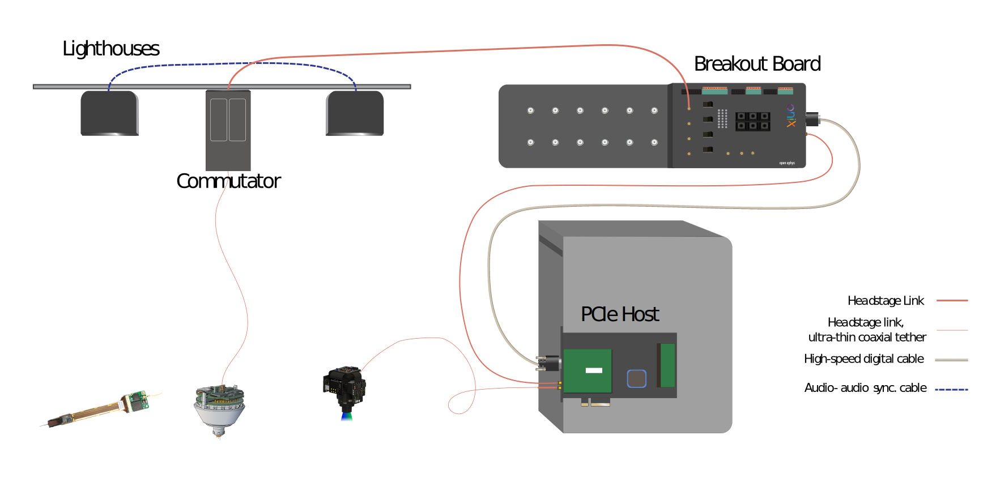

.. _connection_overview:

Connections and Cables
==========================================
This page is meant to help you understand the various connectors and data links
in the ONIX hardware.

Connection types
******************************************
.. _headstage_link:

Headstage Link
--------------------------------
The headstage link allows fast data communication between an ONI compliant headstage and the PCIe host board. This connection is formed by a single coaxial cable for each attached headstage (or other ONI compliant hub, such as a UCLA Miniscope V4). This connection also provides power to the headstage from the PCIe host board.

The headstage link can be formed directly between the host PCIe board and a headstage. Additionally, a headstage link can be extended by connecting an active commutator and/or breakout board between the PCIe board and headstage.

Connectors used for headstage link:

.. image:: ../../_static/images/connections/3_connectors_annotated.jpg
  :align: center
  :width: 50%

* PCIe host board: MMCX connectors
* Breakout board: MMCX connectors (to link to PCIe host) & SMA connectors (to link to commutator or headstage).
* Commutator: SMA connectors to link to both breakout board and headstage.
* The :ref:`headstage_64` & :ref:`headstage_neuropix1`:  Hirose X.FL-PR-SMT1-2(80) X.FL coaxial socket connector.

Digital and Analog I/O
--------------------------------
* `High speed digital cable
  <https://multimedia.3m.com/mws/media/585365O/3mtm-shrunk-delta-ribbon-sdr-cable-assembly-ts2287.pdf>`_
  to connect Host and Breakout Board.

Lighthouses
--------------------------------
* Audio (Lighthouse A) to Audio (Lighthouse B) - to synchronise lighthouses
  (only necessary for V1 Basestations)
* Power cables for lighthouses (x2, provided with lighthouses)

Commutator link
--------------------------------
* Computer (USB) to commutator (micro-USB) cable, to power the commutator &
  provide it with 3D tracking data.

.. _cable_list:

Cable List
******************************************

.. _mmcx_cable:

#. MMCX to MMCX

    .. image:: ../../_static/images/connections/MMCX_cable.jpg
      :align: center
      :scale: 20%

    The MMCX connectors at the end of these cables can easily break off if used incorrectly. When connecting or disconnecting, hold the connector itself instead of pulling at the cabling.

    .. raw:: html

      

 View how to connect and disconnect MMCX:
      

      

        

        

        

          
        

        

          
        

        

        

      

      

#. Digital and Analog I/O link cable, SDR to SDR 26 POS

    - Connects PCIe Host to Breakout Board

    .. image:: ../../_static/images/connections/breakout_IO_cable.jpg
      :align: center
      :scale: 20%

#. Headstage Tethers, coaxial, 0.38 mm OD

    .. image:: ../../_static/images/connections/tether.jpg
      :align: center
      :scale: 20%

#. Headstage Tether Adapters, coaxial, MMXC to SMA

    - Allows headstage tether to be connected to SMAs on Breakout Board
    
    .. image:: ../../_static/images/connections/adaptor_headstage.jpg
      :align: center
      :scale: 20%

#. Commutator power & data cable, USB A to Micro B.

#. SMA to SMA cable

     - Breakout board to Commutator cable (headstage link)

     .. image:: ../../_static/images/connections/sma_cable.jpg
       :align: center
       :scale: 20%

#. Lighthouse synchronization cable, 3.5 mm Stereo Jack Plug to Plug

    .. image:: ../../_static/images/connections/audio_synch_cable.jpg
      :align: center
      :scale: 20%
