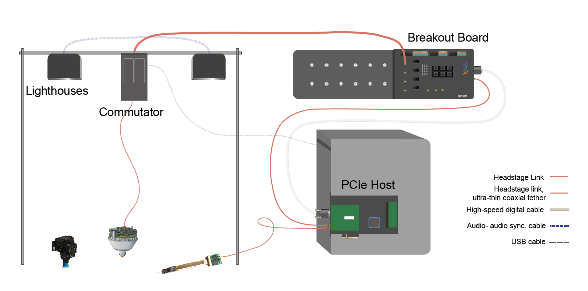
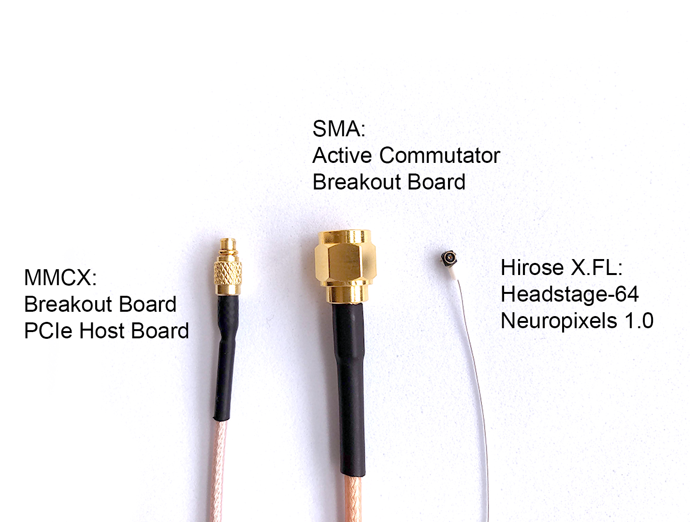
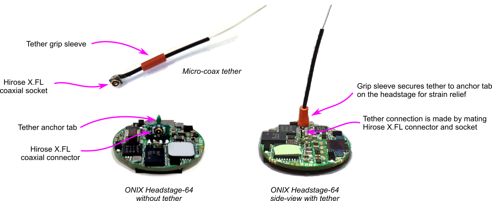

.. _connection_overview:

Connections and Cables
==========================================

Connection types
******************************************
.. _headstage_link:

Headstage Link
--------------------------------
The headstage link allows fast data communication between an ONI compliant headstage and the PCIe host board. This connection is formed by a single coaxial cable for each attached headstage (or other ONI compliant hub, such as a UCLA Miniscope V4). This connection also provides power to the headstage from the PCIe host board.

The headstage link can be formed directly between the host PCIe board and a headstage. Alternatively, a headstage link can include an active commutator and/or breakout board between the PCIe board and headstage.

Connectors used for headstage link:

* PCIe host board: MMCX connectors
* Breakout board: MMCX connectors (to link to PCIe host) & SMA connectors (to link to commutator or headstage).
* Commutator: SMA connectors to link to both breakout board and headstage. To
  learn how to use an elastic string and the hook on the commutator gear to
  counterweigh the headstage and keep the tether out of the
  animal's way while it explores the behavioral arena, visit the `Tether
  Management & Headstage Counterweight
  <https://open-ephys.github.io/commutator-docs/user-guide/tether-management_counterweight.html>`_
  page from the `Commutator Docs <https://open-ephys.github.io/commutator-docs/index.html>`_. 
* The :ref:`headstage_64` & :ref:`headstage_neuropix1`:  Hirose X.FL-PR-SMT1-2(80) X.FL coaxial socket connector.

Digital and Analog I/O
--------------------------------

* `High speed digital cable
  <https://multimedia.3m.com/mws/media/585365O/3mtm-shrunk-delta-ribbon-sdr-cable-assembly-ts2287.pdf>`_
  to connect Host and Breakout Board.

Lighthouses
--------------------------------

* Audio (Lighthouse A) to Audio (Lighthouse B) - to synchronise lighthouses
  (only necessary for V1 Basestations)
* Power cables for lighthouses (x2, provided with lighthouses)

Commutator link
--------------------------------

* Computer (USB) to commutator (micro-USB) cable, to power the commutator &
  provide orientation data.

.. _cable_list:

Cable List
******************************************

.. raw:: html

    

      

      

          
          

              <h5 class="gallery-card. card-header d-flex">Digital & Analog I/O Cable</h5>
              
- SDR to SDR 26 POS

              
- Breakout Board to PCIe Host, Digital and Analog I/O

          

        

      

      

        

          
          

              <h5 class="card-header">Lighthouse Sync Cable</h5>
              
- 3.5 mm Stereo Jack Plug to Plug 

              
- Connects two Vive Basestations

          

        

      

      

      

          
          

              <h5 class="card-header">Headstage Link: SMA Cable</h5>
              
- SMA to SMA cable

              
- Breakout Board to Commutator, Headstage Link

          

        

      

      

      

        

        

            
            

                <h5 class="card-header">Headstage Link: Adaptor</h5>
                
- SMA to MMCX

                
- Connects headstage tether to PCIe Host board

            

          

        

        

        

            
            

                <h5 class="card-header">Headstage Link: MMCX cable</h5>
                
- MMCX to MMCX 

                
- PCIe Host to Breakout Board

            

          

        

        

        

            
            

                <h5 class="card-header">Headstage Link: Micro-Coax Headstage Tether</h5>
                
- SMA to Hirose X.FL, Coaxial, 0.38 mm OD

                
- Breakout Board to Headstage, PCIe to Headstage (with adaptor)

            

          

        

      

.. _mmcx_cable:

Connecting MMCX
------------------------------

The MMCX connectors at the end of these cables can easily break off if used incorrectly. When connecting or disconnecting, hold the connector itself instead of pulling at the cabling.

.. raw:: html

  

 View how to connect and disconnect MMCX:
  

  

    

    

    

      
    

    

      
    

    

    

  

  

Connecting Micro-Coax Headstage Tethers
-----------------------------------------

The micro-coax tether is attached to the headstage via a Hirose X.FL coaxial connector and we use a red piece of tubing as a grip sleeve to secure the tether to the tether anchor tab present on the headstage so as to provide strain relief. 

It is possible to remove the tether, but since it is made to have a snug fit we don't recommend doing this often - only for replacing the tether.