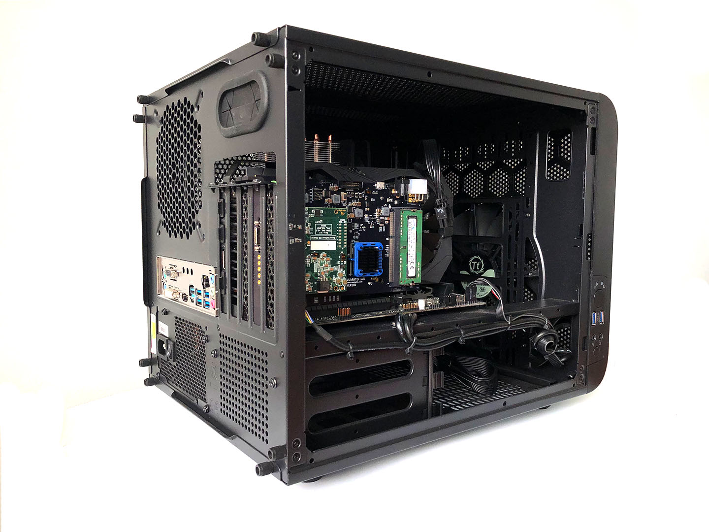

.. _system_setup:

Hardware System Setup
==========================================

How to initially connect and install ONIX hardware.

.. toctree::
    :hidden:

    Connections and Cables

.. contents::
  :depth: 2
  :local:
  :backlinks: none

PCIe and computer
--------------------------------

The PCIe board is installed in a PCIe slot inside the acquisition PC. For Windows to recognise the device, please follow the :ref:`pcie_host_setup_windows`.

Breakout Board
--------------------------------

The breakout board can be mounted on a rack.

Connect the breakout board to the PCIe host board using the high-speed digital cable.

.. note::
  - Test Digital IO
  - Test Buttons
  - Test Analog IO

Headstages/other devices
--------------------------------

* Connect the headstages either directly to host or through the breakout board (see headstage link).
   - The LED on the breakout board (and the PCIe board itself, if visible) should turn purple when the link is made between the headstage and the PCIe host board.
   - Double-clicking on the OniContext node in Bonsai should now show an additional tab, labelled with the type of headstage.
